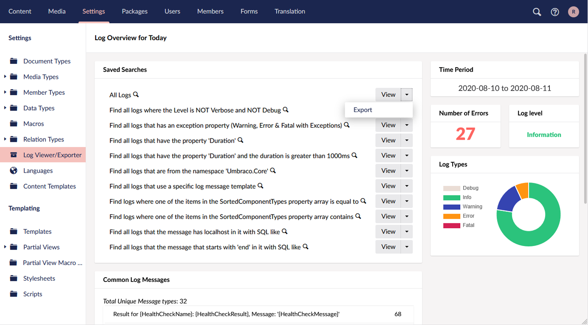
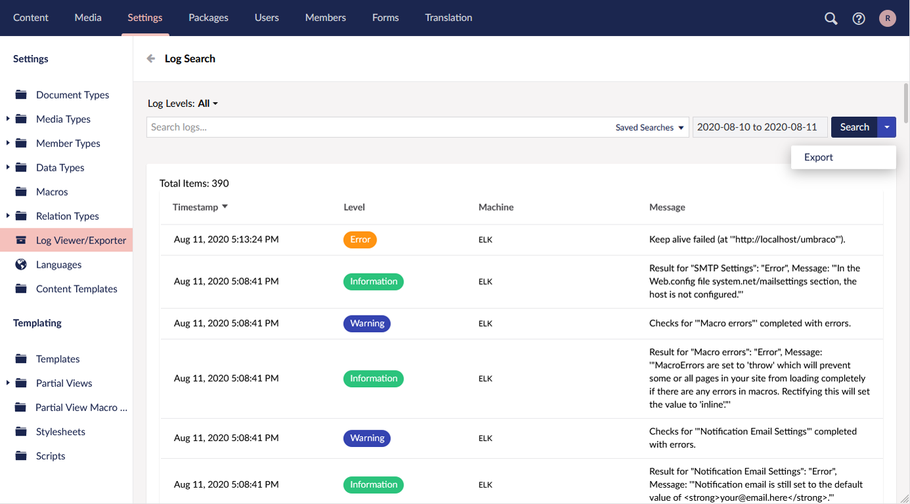

# UmbLogExporter
A Log Viewer replacement for [Umbraco](https://umbraco.com/) 8

## What is UmbLogExporter?
UmbLogExporter builds on the [Log Viewer](https://our.umbraco.com/documentation/getting-started/Backoffice/LogViewer/) that ships with the [Umbraco](https://umbraco.com/) 8 Core adding options to export logs to a format of your choosing. It also tweaks the Log Viewer interface allowing you to change the log date range when searching.

The default export implementation takes logs recorded using the `CompactJsonFormatter` formatter that Umbraco installs with and outputs an Excel file using [EPPlus](https://www.nuget.org/packages/EPPlus/).

## Install
Once installed, the `Log Viewer` node in the settings tree will be replaced with `Log Viewer/Exporter`.

You can export directly from the default page using the `View/Export` button groups next to each search:

You can also export from the `Search` page using the `Search/Export` button group:

The new date range field in the search bar allows for changing the dates without messing with the querystring or returning the default page to change the date span.

## Writing Your Own Exporters
The `UmbLogExporter.Core` project contains the `ILogExportBuilder` interface. The default implementation is `DefaultLogExportBuilder` which will give you a starting point for writing your own exporters.

Excel was a good option to ship with the project as most clients will be familiar with searching data using Excel. However, it could easily export to CSV, a database or a destination of your choosing.

## Contributing

Once you've forked the repo, open the `src\UmbLogExporter.sln` solution in Visual Studio, set the `UmbLogExporter.Website` project as the start up project and hit F5.

The Umbraco backoffice login details are:

Username: root

(Yes, it should be an email address... But we didn't want a dummy email address getting spammed with password reset requests...)

Password: testing1234

## Credits
As 99.9% of the code in this project is based on the Log Viewer that ships with Umbraco 8 it would be rude not to credit the core team - thanks for all your hard work guys!
